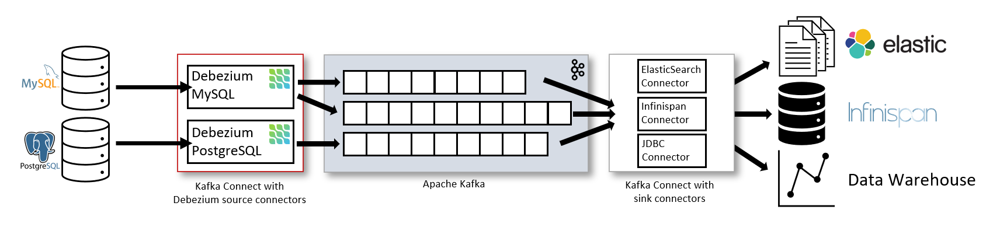

# Welcom to debezium by Viet Anh 2024

## clone my git
```shell
    git clone https://github.com/nvietanh2406/debezium.git \
    && cd debezium\nva-documents \
    && code .
     
```


## Building Debezium

The following software is required to work with the Debezium codebase and build it locally:

* [Talend Kafka](https://github.com/nvietanh2406/debezium/tree/main/nva-documents/talend-kafka) project kafka connector for talendBD 

* [Debezium Architecture](https://debezium.io/documentation/reference/2.3/architecture.html) project kafka connector for talendBD 




# 1. first debut project with postgrest

Ở ví dụ cài đặt hiện tại, trình cắm đầu ra bộ giải mã để giải mã logic được sử dụng. Plug-in đầu ra của bộ giải mã sẽ tạo ra thông báo Protobuf cho mỗi thay đổi cơ sở dữ liệu. Mỗi thông báo chứa các bộ dữ liệu mới/cũ cho một hàng trong bảng được cập nhật. Quá trình biên dịch và cài đặt phần bổ trợ được thực hiện bằng cách thực thi các lệnh liên quan được trích xuất từ ​​Debezium Dockerfile.

Trước khi thực thi các lệnh, hãy đảm bảo rằng người dùng có đặc quyền ghi thư viện giải mã tại thư mục lib PostgreSQL (tại môi trường thử nghiệm, thư mục là: /usr/lib64/pgsql/). Cũng lưu ý rằng quá trình cài đặt yêu cầu tiện ích PostgreSQL pg_config. Xác minh rằng biến môi trường PATH được đặt để có thể tìm thấy tiện ích. Nếu không, hãy cập nhật biến môi trường PATH một cách thích hợp. Ví dụ ở môi trường thử nghiệm:


```shell

$ git clone https://github.com/debezium/postgres-decoderbufs -b v{debezium-version} --single-branch \
&& cd postgres-decoderbufs \
&& make && make install \
&& cd .. \
&& rm -rf postgres-decoderbufs

 ```    

 decoderbufs installation output
 ```shell
 Cloning into 'postgres-decoderbufs'...
remote: Enumerating objects: 288, done.
remote: Counting objects: 100% (4/4), done.
remote: Compressing objects: 100% (4/4), done.
remote: Total 288 (delta 0), reused 1 (delta 0), pack-reused 284
Receiving objects: 100% (288/288), 91.62 KiB | 3.66 MiB/s, done.
Resolving deltas: 100% (131/131), done.
Note: switching to 'c9b00aa8c093fa77e08b256bb09d33069a30db86'.

You are in 'detached HEAD' state. You can look around, make experimental
changes and commit them, and you can discard any commits you make in this
state without impacting any branches by switching back to a branch.

If you want to create a new branch to retain commits you create, you may
do so (now or later) by using -c with the switch command. Example:

  git switch -c <new-branch-name>

Or undo this operation with:

  git switch -

Turn off this advice by setting config variable advice.detachedHead to false

gcc -Wall -Wmissing-prototypes -Wpointer-arith -Wdeclaration-after-statement -Wendif-labels -Wmissing-format-attribute -Wformat-security -fno-strict-aliasing -fwrapv -fexcess-precision=standard -Wno-format-truncation -Wno-stringop-truncation -O2 -g -pipe -Wall -Werror=format-security -Wp,-D_FORTIFY_SOURCE=2 -Wp,-D_GLIBCXX_ASSERTIONS -fexceptions -fstack-protector-strong -grecord-gcc-switches -specs=/usr/lib/rpm/redhat/redhat-hardened-cc1 -specs=/usr/lib/rpm/redhat/redhat-annobin-cc1 -m64 -mtune=generic -fasynchronous-unwind-tables -fstack-clash-protection -fcf-protection -fPIC -std=c11  -I/usr/local/include  -I. -I./ -I/usr/include/pgsql/server -I/usr/include/pgsql/internal  -D_GNU_SOURCE -I/usr/include/libxml2   -c -o src/decoderbufs.o src/decoderbufs.c
gcc -Wall -Wmissing-prototypes -Wpointer-arith -Wdeclaration-after-statement -Wendif-labels -Wmissing-format-attribute -Wformat-security -fno-strict-aliasing -fwrapv -fexcess-precision=standard -Wno-format-truncation -Wno-stringop-truncation -O2 -g -pipe -Wall -Werror=format-security -Wp,-D_FORTIFY_SOURCE=2 -Wp,-D_GLIBCXX_ASSERTIONS -fexceptions -fstack-protector-strong -grecord-gcc-switches -specs=/usr/lib/rpm/redhat/redhat-hardened-cc1 -specs=/usr/lib/rpm/redhat/redhat-annobin-cc1 -m64 -mtune=generic -fasynchronous-unwind-tables -fstack-clash-protection -fcf-protection -fPIC -std=c11  -I/usr/local/include  -I. -I./ -I/usr/include/pgsql/server -I/usr/include/pgsql/internal  -D_GNU_SOURCE -I/usr/include/libxml2   -c -o src/proto/pg_logicaldec.pb-c.o src/proto/pg_logicaldec.pb-c.c
gcc -Wall -Wmissing-prototypes -Wpointer-arith -Wdeclaration-after-statement -Wendif-labels -Wmissing-format-attribute -Wformat-security -fno-strict-aliasing -fwrapv -fexcess-precision=standard -Wno-format-truncation -Wno-stringop-truncation -O2 -g -pipe -Wall -Werror=format-security -Wp,-D_FORTIFY_SOURCE=2 -Wp,-D_GLIBCXX_ASSERTIONS -fexceptions -fstack-protector-strong -grecord-gcc-switches -specs=/usr/lib/rpm/redhat/redhat-hardened-cc1 -specs=/usr/lib/rpm/redhat/redhat-annobin-cc1 -m64 -mtune=generic -fasynchronous-unwind-tables -fstack-clash-protection -fcf-protection -fPIC -shared -o decoderbufs.so src/decoderbufs.o src/proto/pg_logicaldec.pb-c.o -L/usr/lib64  -Wl,-z,relro  -Wl,-z,now -specs=/usr/lib/rpm/redhat/redhat-hardened-ld  -Wl,--as-needed  -lprotobuf-c
/usr/bin/mkdir -p '/usr/lib64/pgsql'
/usr/bin/mkdir -p '/usr/share/pgsql/extension'
/usr/bin/install -c -m 755  decoderbufs.so '/usr/lib64/pgsql/decoderbufs.so'
/usr/bin/install -c -m 644 .//decoderbufs.control '/usr/share/pgsql/extension/'
 ```